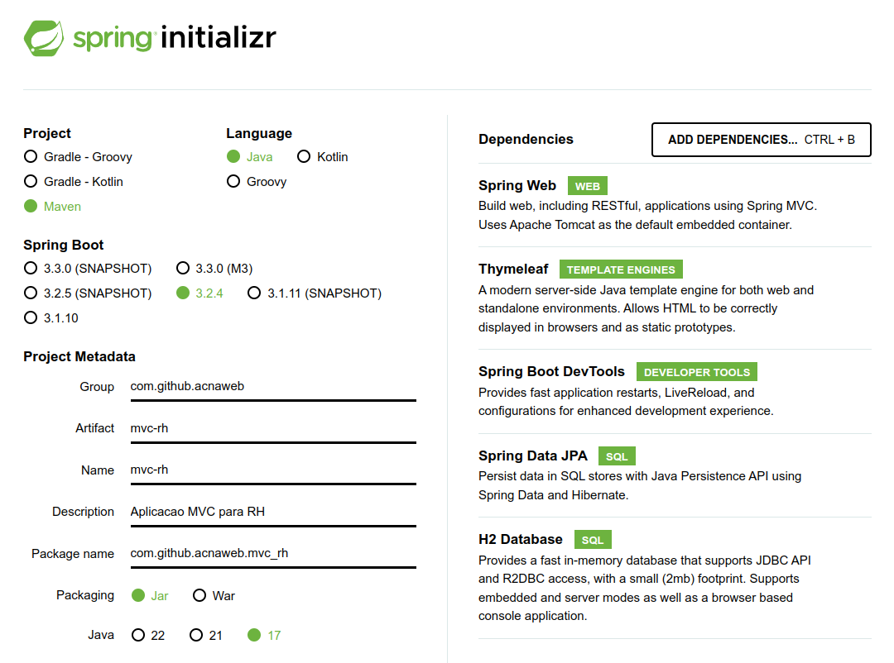
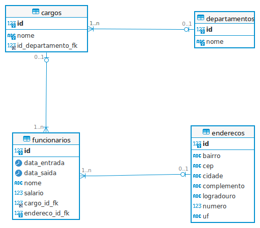

# Microservices and Web Engineering

### [Apresentações](/apresentacao.md)

----

### Projetos

| Repositório | 
|----|
| [Repositório de conteúdos e acompanhamento de aulas](https://github.com/acnaweb/microservices-2024) |
| [Thymeleaf](https://github.com/acnaweb/thymeleaf) |
| [Ping](https://github.com/acnaweb/ping) |
| [MVC RH](https://github.com/acnaweb/mvc-rh) |
| [E-commerce](https://github.com/acnaweb/ecommerce) |

### 2º Semestre

__16/08__


__09/08__

- [ ] HTTP 
    - [Protocolo HTTP Overview](https://developer.mozilla.org/pt-BR/docs/Web/HTTP/Overview)
- [ ] JSON
    - [JSON](https://www.json.org/json-en.html)
    - [JSON Viewer](http://jsonviewer.stack.hu/) 
- [ ] JSON Server
    - NodeJS [NVM](https://github.com/nvm-sh/nvm)
    - [NodeJS](https://nodejs.org/en/download/) 
    - [JSON Server](https://www.npmjs.com/package/json-server)
- [ ] API Client
    - [Postman](https://www.postman.com/)
- APIs Públicas
    -  [Via CEP](https://viacep.com.br/)
    -  [SPTrans/API do Olho Vivo](https://www.sptrans.com.br/desenvolvedores/)
      
### 1º Semestre

----

__* 03/05__

* Projeto [MVC RH](https://github.com/acnaweb/mvc-rh) |
    
    - Navegação por fragmentos

* Web

    - https://www.w3schools.com/icons/default.asp
```
<link href="https://cdnjs.cloudflare.com/ajax/libs/font-awesome/5.15.4/css/all.min.css" rel="stylesheet">
```

```
<html xmlns:th="http://www.thymeleaf.org">
```     

__* 26/04__

* Projeto [MVC RH](https://github.com/acnaweb/mvc-rh) |

    - Criação de conteúdos de views

* [Checkpoint 3](checkpoints/checkpoint-3-sem1.md)

__* 12/04 e 19/04__

* Projeto [MVC RH](https://github.com/acnaweb/mvc-rh) |

* [Checkpoint 2](checkpoints/checkpoint-2-sem1.md)


__* 05/04__

* Projeto [MVC RH](https://github.com/acnaweb/mvc-rh) |





* [Docker para Databases](https://github.com/acnaweb/database)

----

__* 22/03__

### Database

- Persistencia
    - [Hibernate](https://hibernate.org/)
    - [H2 Database](https://www.h2database.com/html/main.html)
    - Oracle
    - [Oracle x Java: Type mapping](https://docs.oracle.com/cd/A97335_02/apps.102/a83724/basic3.htm)
    - [Spring profile/data.sql](https://www.baeldung.com/spring-boot-data-sql-and-schema-sql)
    - [Migration](https://www.baeldung.com/database-migrations-with-flyway)

#### Adicionar dependencias

```sh
<dependency>
        <groupId>org.springframework.boot</groupId>
        <artifactId>spring-boot-starter-data-jpa</artifactId>
</dependency>
```

- Driver JDBC H2 - https://www.baeldung.com/spring-boot-h2-database
- Driver JDBC Oracle

#### Configurar BD
* application-dev.properties
  
```sh
spring.datasource.url=jdbc:h2:mem:testdb
spring.datasource.driverClassName=org.h2.Driver
spring.datasource.username=sa
spring.datasource.password=password
spring.jpa.database-platform=org.hibernate.dialect.H2Dialect
spring.jpa.show-sql=true
spring.h2.console.enabled=true
spring.jpa.hibernate.ddl-auto=create
spring.sql.init.mode=always
spring.jpa.defer-datasource-initialization=true
```
* application-[stg/prg].properties

```sh
spring.datasource.url=jdbc:oracle:thin:@oracle.fiap.com.br:1521:orcl
spring.datasource.driverClassName=oracle.jdbc.OracleDriver
spring.datasource.username=pf1524
spring.datasource.password=
spring.jpa.database-platform=org.hibernate.dialect.Oracle10gDialect
spring.jpa.show-sql=true
spring.jpa.hibernate.ddl-auto=update
```

* Carga inicial de dados
```sh
spring.sql.init.data-locations=classpath:data-dev.sql
```

----

__* 15/03__

[Tutorial Bootstrap](https://www.youtube.com/watch?v=SmQMZ36hJJY&list=PLnDvRpP8Bnexu5wvxogy6N49_S5Xk8Cze)

#### Repositório - Setup Padrão

> - Create Spring Initializr
> - Create repo
> - Git init
> - application.properties
> - Docker Image
> - pom.xml
>	- build.finalName
----

__* 13/03__

- [Docker Multi-stage](https://docs.docker.com/build/building/multi-stage/)

----

__08/03__

- Aviso de [checkpoint 1](/checkpoints/checkpoint-1-sem1.md)
- Maven

pom.xml
```
<build>
        <finalName>app</finalName>
        ....
</build>        
```                
- [Docker Hub](https://hub.docker.com/)
- [Dockerfile](https://docs.docker.com/reference/dockerfile/)
- Markdown
    - [Guia](https://abhiappmobiledeveloper.medium.com/guide-to-writing-on-readme-md-markdown-file-for-github-project-8aad4e4e2a15)
    - [Emojis](https://gist.github.com/rxaviers/7360908)
    - [Table](https://www.tablesgenerator.com/markdown_tables)
    - [Editor online](https://dillinger.io/)
    - [Exemplo](/conceitos/markdown.md)
  

----

__01/03__

- Conteinerização
    - [Docker](https://www.docker.com/)        
    - [Docker Cheatsheet](https://docs.docker.com/get-started/docker_cheatsheet.pdf)
    - [Docker/Playground](https://labs.play-with-docker.com/)
----

__23/02__

- Git
- [Spring](/conceitos/spring.md)

__16/02__

- Git
- [Spring](/conceitos/spring.md)
- [Maven](/conceitos/maven.md)

__09/02__

- Apresentações
- O curso

----

### Objetivos do Curso

- Desenvolver aplicação RESTful API
    - Spring Boot
    - Spring Data
    - Authorization/Authentication
    - Caching
    - Pagination and Sorting
    - Unit Test
    - OpenAPI - Swagger
    - Profiles: dev/stg/prd
- Docker: Container
- Deploy: Cloud Azure

### Extras

- GitHub: CI/CD
- API Gateway
- Event Driven: Kafka

### Metodologia

- Apresentação de conceito e implementação de forma interativa e cíclica.
- Criação de projetos no Github.
- Material disponível neste repositório.
- A cada aula o conteúdo é registrado neste repositório.

### Requisitos

- Github Account
- Azure Account (https://portal.azure.com/)
- Docker Hub Account
- Java 17
- Git
- Docker

### Plano de Estudo

- Versionamento de Código
    - [Github](https://github.com/)
    - [Git Client](https://www.alura.com.br/conteudo/git-github-controle-de-versao--amp)
    - [Git](/conceitos/git.md)
    - [Git/Artigo](https://www.alura.com.br/artigos/comecando-com-git-aprendendo-versionar)
    - [Git/Cheat Sheet](https://education.github.com/git-cheat-sheet-education.pdf)
    - [Gitflow](https://www.atlassian.com/br/git/tutorials/comparing-workflows/gitflow-workflow)
    - [Markdown](https://dillinger.io/)

- [HTTP](https://developer.mozilla.org/pt-BR/docs/Web/HTTP)
    - [Status HTTP](https://developer.mozilla.org/pt-BR/docs/Web/HTTP/Status)
    - [Métodos HTTP](https://developer.mozilla.org/pt-BR/docs/Web/HTTP/Methods)
    - [Portas TCP/UDP](https://pt.wikipedia.org/wiki/Lista_de_portas_dos_protocolos_TCP_e_UDP)

- Persistencia
    - [Hibernate](https://hibernate.org/)
    - [H2 Database](https://www.h2database.com/html/main.html)
    - Oracle
    - [Oracle x Java: Type mapping](https://docs.oracle.com/cd/A97335_02/apps.102/a83724/basic3.htm)
    - [Spring profile/data.sql](https://www.baeldung.com/spring-boot-data-sql-and-schema-sql)
    - [Migration](https://www.baeldung.com/database-migrations-with-flyway)

- Software
    - [Spring Framework](/conceitos/spring.md)
    - [12Factors](https://github.com/acnaweb/12factors)
    - [Maven](/conceitos/maven.md)
    - [Design Patterns](https://www.tutorialspoint.com/design_pattern/index.htm)

- Spring
    - [Spring Initializr](https://start.spring.io/)
    - [spring-boot-devtools](https://www.baeldung.com/spring-boot-devtools)
    - [Spring profile](https://docs.spring.io/spring-boot/docs/1.2.0.M1/reference/html/boot-features-profiles.html)
    - [Spring Starters](https://docs.spring.io/spring-boot/docs/current/reference/html/using.html#using.build-systems.starters)

- MVC
    - [MVC](/conceitos/mvc.md)
    - Spring Boot MVC    
    - [Thymeleaf](https://www.thymeleaf.org/)
- Restful API
    - [API Rest](https://blog.betrybe.com/desenvolvimento-web/api-rest-tudo-sobre/)
    - JSON Server
    - JSON
    - [Json Path](https://jsonpath.com/)
    - Postman
    - [Arquitetura de Microserviços](https://microservices.io/)
    - Spring Boot API    
    - Cache 
    - [DTO Pattern](https://www.baeldung.com/java-dto-pattern)
    - Mapeamento com ModelMapper
    - [Validação de DTO](https://www.javaguides.net/2021/04/spring-boot-dto-validation-example.html)
    - Paginação
    - [Handler Exception](https://www.baeldung.com/exception-handling-for-rest-with-spring)
    - [Swagger/Documentação](https://swagger.io/)

- Produtividade
    - [Lombok](https://projectlombok.org/)

- Conteinerização
    - [Docker](https://www.docker.com/)
    - [Docker/Playground](https://labs.play-with-docker.com/)
    - [Docker Hub](https://hub.docker.com/)
    
- DevOps
    - [CI/CD](https://codefresh.io/learn/ci-cd/7-ci-cd-concepts-you-must-know/)
    - [Teste unitários](https://junit.org/junit5/)
    - [Github Actions](https://docs.github.com/pt/actions)

- Cloud
    - Azure
    - Azure Web App   

- Java
    - [Java Method Reference](https://www.baeldung.com/java-method-references)         
    - [Data/hora calendar/simpledateformat](https://www.devmedia.com.br/trabalhando-com-as-classes-date-calendar-e-simpledateformat-em-java/27401)
    - [Data/hora date](https://www.w3schools.com/java/java_date.asp)
    - [Data/hora datetime](https://www.baeldung.com/java-8-date-time-intro)

### Cursos Alura

#### Java e Persistencia
- [jdbc-dao-persistenci](https://cursos.alura.com.br/course/jdbc-dao-persistencia)
- [java-jpa-consultas-avancadas-performance-modelos-complexo](https://cursos.alura.com.br/course/java-jpa-consultas-avancadas-performance-modelos-complexos)
- [servlets-fundamentos-programacao-web-jav](https://cursos.alura.com.br/course/servlets-fundamentos-programacao-web-java)
- [servlet-autenticacao-autorizacao-mvc](https://cursos.alura.com.br/course/servlet-autenticacao-autorizacao-mvc)

#### Microserviços
- [microsservicos-padroes-projeto](https://cursos.alura.com.br/course/microsservicos-padroes-projeto)
- [fundamentos-microsservicos-aprofundando-conceitos](https://cursos.alura.com.br/course/fundamentos-microsservicos-aprofundando-conceitos)
- [microsservicos-implementando-java-spring](https://cursos.alura.com.br/course/microsservicos-implementando-java-spring)
- [spring-boot-3-desenvolva-api-rest-java](https://cursos.alura.com.br/course/spring-boot-3-desenvolva-api-rest-java)
- [spring-boot-aplique-boas-praticas-proteja-api-rest](https://cursos.alura.com.br/course/spring-boot-aplique-boas-praticas-proteja-api-rest)
- [microservices-spring-cloud-service-registry-config-server](https://cursos.alura.com.br/course/microservices-spring-cloud-service-registry-config-server)
- [microsservicos-pratica-iac-cdk-deploy-aws](https://cursos.alura.com.br/course/microsservicos-pratica-iac-cdk-deploy-aws)

#### Transformação Digital
- [formacao-transformacao-digital](https://www.alura.com.br/formacao-transformacao-digital)

#### Docker
- [docker-criando-gerenciando-containers](https://alura.com.br/curso-online-docker-criando-gerenciando-containers)

### Links úteis

- [eBooks](https://www.kdnuggets.com/2015/09/free-data-science-books.html)

### [Sem categoria](/conceitos/sem_categoria.md)
