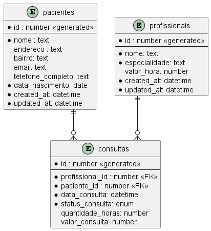

# Microservice and Web Engineering - 3SIT/2024

## Check Point 2/1º semestre - Prof. Antonio Carlos de Lima Júnior

### Instruções Gerais

- Prazo de entrega: __19/04__.
- O checkpoint deverá ser desenvolvido em até 3 pessoas.
- Cada membro deve ter o projeto em seu próprio repositório no Github até a data de entrega.

Configurações do Projeto

> - Project: 	Maven Project
> - Language: 	Java
> - Spring Boot: 3.1.*

Project Metadata

> - Group: 	br.com.fiap
> - Artifact: 	checkpoint2
> - Name: 	checkpoint2
> - Description: Checkpoint 2
> - Package Name: br.com.fiap.checkpoint2
> - Packaging: 	Jar
> - Java: 		17

### Atividades

#### 1. (_0,5 ponto_) - Criar um projeto Java usando Spring Boot:

Adicionar as dependencias necessárias para criação de aplicação Web com Banco de Dados.

#### 2. (_0,5 ponto_) - Adicionar 3 Spring profiles: 

* Dev
> * dev - porta 8080 com conexão para BD H2
> * stg - porta 8080 com conexão para BD MySQL
> * prd - porta 8080 com conexão para BD Oracle

#### 3. (_ 0,5 ponto_) - Criar o Dockerfile para aplicação Web Java

O Dockerfile deverá conter as instruções para compilação e execução da aplicação.

#### 4. (_0,5 ponto_) -  Imagem no Docker Hub 

Upload da imagem do docker hub do respectivo membro

> - nome do repositório: fiap-checkpoint2
> - tag: lastest

#### 5. (_0,5 ponto_) - Adicionar instruções no README.md do respostório

> - Comando "docker" para executar a aplicação a partir do docker hub do __respectivo membro__ com profile "dev"
> - Comando "docker" para executar a aplicação a partir do docker hub do __respectivo membro__ com profile "stg"
> - Comando "docker" para executar a aplicação a partir do docker hub do __respectivo membro__ com profile "prd"

#### 6. (_7,5 pontos_) - Implementar as entidades de classe e tabelas de banco de dados no respectivo sistema gerenciador de banco de dados (SGBD).

status_consulta: enum {AGENDADA, CANCELADA, REALIZADA}

### Entregáveis

> A validação da criação do banco de dados será realizada apenas pelo profile **"dev"**.

#### 1. Github (para cada membro)

Nome do repositorio: __fiap-checkpoint2__

#### 2. Docker hub (para cada membro)

Nome do repositorio: __fiap-checkpoint2__

#### 3. Arquivo para área de entrega de trabalhos

Arquivo txt contendo as seguintes informações no exemplo abaixo:

| Aluno(a) | Github |
| --- | --- |
| Maria | https://github.com/maria/fiap-checkpoint2 |
| João | https://github.com/joao/fiap-checkpoint2 |
| Ana | https://github.com/ana/fiap-checkpoint2 |

