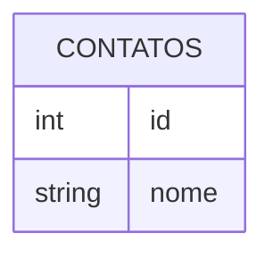

# Microservice and Web Engineering - 3SIT/2024

## Check Point 3/2º semestre - Prof. Antonio Carlos de Lima Júnior

### Instruções Gerais

- Prazo de entrega: __07/11__.
- O checkpoint deverá ser desenvolvido em até 2 pessoas.
- Cada pessoa deve ter o projeto em seu próprio repositório "fiap-checkpoint3-sem2" no Github até a data de entrega.
- Cada pessoa realizar a entrega na área de trabalho informando o link do repositório no Github.

### Atividades

- Diagrama Entidade Relacionamento (DER)
  

Objetivo: Criar uma aplicação API Rest Java com Spring Boot e banco de dados MySQL. 
A aplicação deverá possuir rotas para operações CRUD na tabela CONTATOS definida no DER.

Rotas:
  - GET /contatos - Listar todos os contatos
  - GET /contatos{id} - Pesquisar um contato por id
  - GET /contatos?nome=<Nome Informado na Pesquisa> - Pesquisar um contato por nome
  - POST /contatos - Criar um contato novo
  - PUT /contatos - Atualizar um contato existente
  - DELETE /contatos - Excluir um contato existente

#### 1. (_1 pontos_) - Criar a camada de Persistencia (Repository).
#### 2. (_2 pontos_) - Criar a camada Service.
#### 3. (_2 pontos_) - Criar a camada Controller.
#### 4. (_3 pontos_) - Utilizar DTOs e Mapper.
#### 5. (_1 pontos_) - Gerar a documentação automática com OpenAPI.
#### 6. (_1 pontos_) - Utilizar Lombok.
